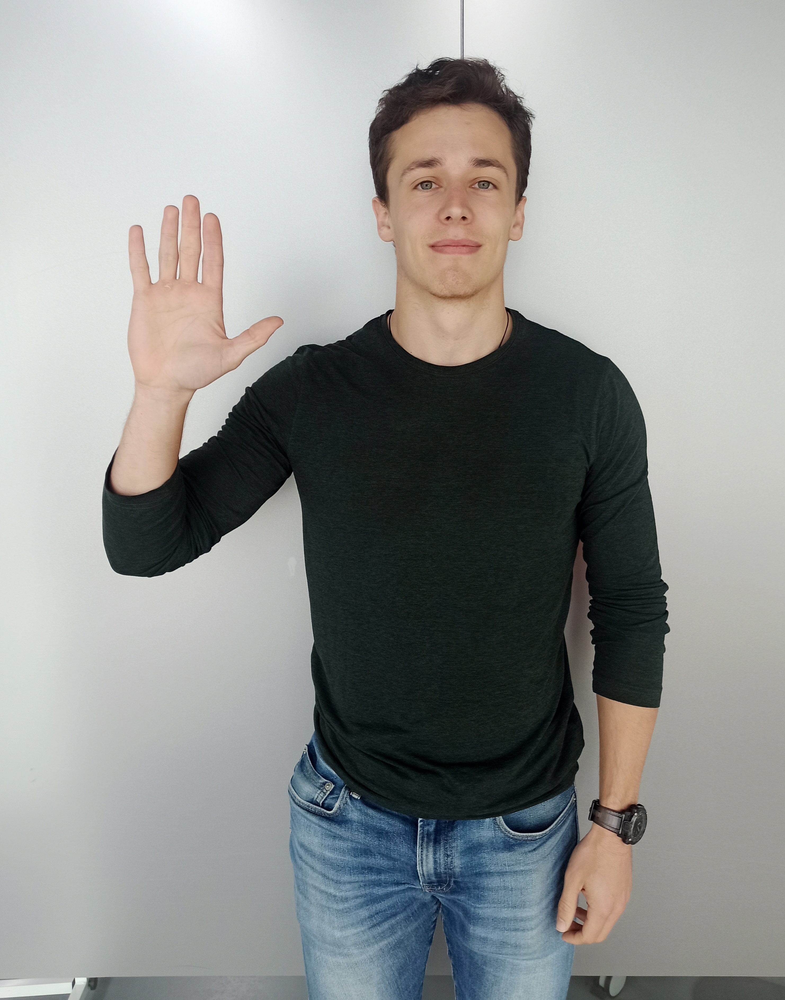
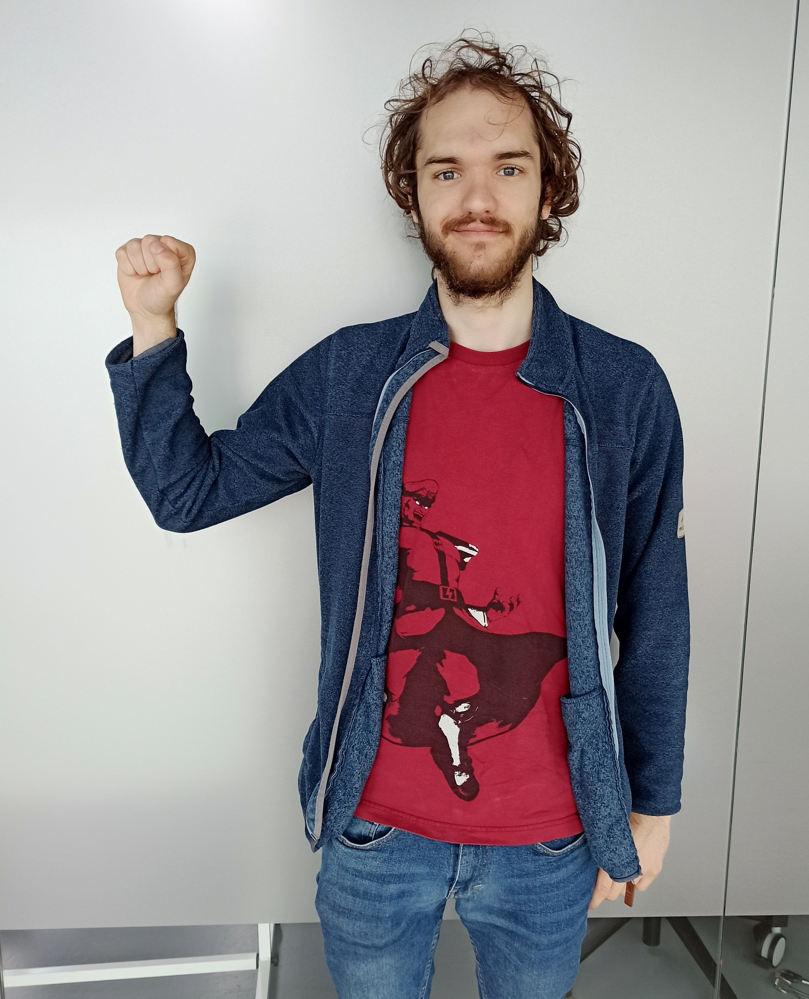

[//]: # (WIP ZONE: MATTI ///////////////////////////////////////////////////////////////////)

# Sign detections with lottery ticket hypothesis using PyTorch

Paul Féry
Matti Lang
Yohan Le Gars

  In this blog post we discuss our approach of creating a sign language dataset from scratch, traning a deep learning model and implementing the lottery ticket hypothesis. The end-goal is to transfer the model on a RaspberryPi which will be connected to a small robot car. Therefore, it is important for the model to be lightweight and to reduce as many parameters as possible with the lottery ticket implementation in order to run the model for a real-time application. 
  
## The Signs
 
The dataset consists of five different signs: "forward", "backward", "left" and "right","stop". The images can be seen below:

  
   
  
  
  

[//]: # (WIP ZONE: PAUL ///////////////////////////////////////////////////////////////////)

## Image Creation process

We wanted to automate the process of generating image samples for the dataset as much as possible. That way it would facilitate the addition of new samples if performance deemed it necessary. Additionally, if we wanted to add new signs (ie, additional class labels for the model to learn), creating that data would be simple and time-efficient.

With that in mind, we implemented a [simple script](https://github.com/yohanlegars/Hand-Commands/blob/e11a10a30cf5535e66404ad2855839202c5d915f/code/datasets/image_generator.py#L140) that ensures a fast and efficient process for taking images. The user simply needs to specify the following arguments:
- --LABELS, a list of strings, corresponding to the different signs the user would like to create images for
- --NUMBER_IMGS, the number of images they would like to take for each specified sign
- --MODE, which can be:
  - "timed": image samples are taken from the user's webcam/camera sequentially, using a timer. The user performs the first gesture a number of times equal to NUMBER_IMGS, then continues to the second, third, etc.
  - "manual": the user can press the spacebar on their computer to take images using their camera. The advantage is more control on the timing, but they have to stand close to their computer.
- --SAVE_PATH, a path on their computer, where the generated images will be stored.
- --CAPTURE_ARG, a necessary argument for identifying the camera hardware that will be used for the process. This almost always defaults to '0', it is essentially only ever used for computers with multiple webcams connected to them.

Sampling images is made quick and easy, while the script is running, visual feedback is provided to help the user in the process. They directly see what the camera sees, as well as what sign they must be performing a gesture for. If the mode is set to timed, a decreasing timer is also shown, indicating when the next sample will be taken.

[//]: # (TODO: SHORT GIF OF THE PROCESS HERE)

## Annotation process

Sampling images is not the only part of the dataset creation process. If we want to be able to perform nice predictions, we also want the labels corresponding to our sampled images. For our task, the labels are the sign type [REFER TO SIGN TYPE SECTION HERE], and the location of the sign in the image.

This is definitely the most time-consuming part of the dataset creation. Each image must be individually provided with its own label and coordinates for the sign. Nevertheless, it is possible to make the process efficient, to a reasonable extent. For this, we initially used the annotation program [labelImg](https://github.com/tzutalin/labelImg), which provides ample functionalities. However, building a dataset with multiple contributors requires an easy way to pool each team member's generated data and annotations in a common place. As a result, we ended up choosing an [online platform](https://roboflow.com/) to facilitate our work within the team. This is by no means required, and if you were to choose to work on your own on a custom dataset, we would recommend to use the labelImg program.

In the end, each image is provided with its own annotation file, which looks like this:

  

For our project, the hand sign / class label correspondences are as follows:

| Hand Sign | Label |
|-----------|-------|
| backward  | 0     |
| forward   | 1     |
| left      | 2     |
| right     | 3     |
| stop      | 4     |

For the bounding box, each of the dimensions are normalized with respect to the input image resolution.

## The Model

Our initial attempt at an architecture was a reproduction from scratch of the [YOLOv3 model](https://pjreddie.com/media/files/papers/YOLOv3.pdf). This process did unfortunately not fare the way we initially hoped to follow. Complications in implementing the architecture from scratch made it difficult to obtain a working, self-made version of the model. Those manifested themselves mostly in lack of coordination in the creation of the several components of the process: building everything from scratch requires precise coordination between how the architecture is built, how its training loop is built, and how the dataset extraction process is conducted. We arrived at a stage where a training loop and dataset classes were fully implemented and ready, using Pytorch. However, the dataset class does not prepare label tensors in the format that is accepted by YOLO. Although fixing this issue was no concern in terms of our capabilities, heavy time constraints related to the schedule imposed for the project led us to abandon this route, and work using a [YOLOv5 model provided by ultralytics](https://github.com/ultralytics/yolov5). With the benefit of hindsight, a lot could have been done differently with respect to this design process, which would have permitted the success of creation of our own version of a YOLO architecture.

### A (brief) History of YOLO

YOLOv5 is the latest iteration of the YOLO architecture. At its core, the YOLO architecture is a single stage object detection module. It is fast enough to permit real time use with video, and has remained within the state of the art for the object detection task since [it was first introduced in 2015](https://arxiv.org/abs/1506.02640).

The key idea behind the architecture is to divide input images into an *SxS* grid of cells: for example, with *S=7*:

  

Each cell is taking care of making a pre-specified number *B* of bounding box predictions (with 4 arguments, indicating the center position and dimensions of the box). Each bounding box prediction is accompanied with a *confidence score*; *Pc*. Each bounding box is therefore fully specified as a vector [*Pc*, *x*, *y*, *w*, *h*]. Additionally, cells are also estimating conditional class probabilities for every label the model is being trained on. Those probabilities can be interpreted as "the probability that an object of a given class *Ci* is present inside the cell, if it is admitted that an object *is* indeed present in the cell".
The output of a prediction made by YOLO on an input image has a total of *SxSx(Bx5+C)* dimensions, where *S* is the number of cells along each dimension, *B* is the number of bounding box predictions per cell, and *C* is the number of classes. In the case that each cell is assigned 3 box predictions to make, and there are 5 distinct classes, each cell produces a prediction tensor of the format:

  

Training instances must also be of the same format: the information contained within the label files (as shown in the previous section) are therefore processed accordingly before training (conditional class probabilities and confidence scores are set to 1, or 0, since the manually labelled images do contain that information with certainty).

The architecture that takes care of converting an input image into a prediction tensor can be seen here:

  

Let it be noted that this schematic of the architecture is taken from the [original article](https://arxiv.org/abs/1506.02640) of the first version of YOLO. Number of improvements on the architecture have been made over the years, which we will discuss very briefly.

The first iteration over the initial design of YOLO is [YOLOv2](https://arxiv.org/abs/1612.08242v1). Its most notable improvements consist of the introduction [batch normalization](https://arxiv.org/abs/1502.03167), which acts as a regularizer, but most importantly, the choice of using anchor boxes for the bounding box regression task. Output tensors now each have conditional class probabilities estimations for every bounding box within each cell: continuing with the example shown just above for YOLO, YOLOv2 and every one that follow it will output tensors of the following format, for each cell (number of dimensions of the final output tensor is *SxSx(Bx(5+C))*):

  

Note that the introduction of anchor boxes consists in the addition of prior knowledge about the type of images the architecture is expected to work with. Concretely, the authors perform k-means clustering of the ground truth bounding box dimensions in order to construct their anchor box dimensions (you can refer to [the article](https://arxiv.org/abs/1612.08242v1) for more details).

[YOLOv3](https://arxiv.org/abs/1804.02767) compiles a number of minute improvements made by the original authors of YOLO. The classification task is now reformulated into a multilabel classification using Binary Cross Entropy instead of Cross Entropy. The difference is important when training on datasets with non mutually exclusive labels such as "woman" and "human" for example. Additionally, the model now performs multiscale predictions: ie, the boxes are predicted at 3 different scales, in a similar fashion than descirbed in [this article](https://arxiv.org/abs/1612.03144). Finally, they introduce a deeper, more performant network in order to perform the task. It consists of 53 convolutional layers (some of which with *3x3* kernels, others with *1x1*), and it makes use of shortcut connections. They call the architecture Darknet-53.

[//]: # (WIP ZONE HERE: MODEL DESCRIPTION ABOVE, ANYTHING ELSE UNDERNEATH ######)

### Training
In order to speed up the training process it was decided to use the Google Cloud Patform (GCP). 
The details of the VM instance used are shown below:

|     GPU type      | Numbers of GPU |    Machine type    |Operating system|          Boot disk type            |
|-------------------|----------------|--------------------|----------------|------------------------------------|
| NVIDIA Tesla P100 |       1        | 8vCPU, 30 GB memory|Ubuntu 20.04 LTS|Balanced persistent disk (size 50GB)|

### Sparse YOLOv5 

  

  

